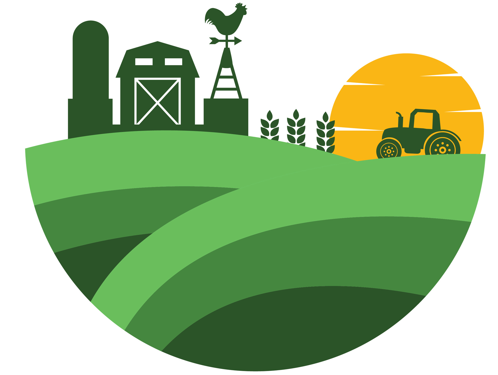

### Hi there 👋

I am a data scientist at the [Yara International](https://www.yara.de/). 
My primary research interest is in **Pedometrics** with a particular focus on **Digital Soil Mapping**. The core of the pedometric approach integrates soil system knowledge with **Advanced Statistical Methods**, **Machine Learning**, **Geospatial Data Analysis**, and **Remote Sensing**. 

My [Personal Website](https://ruhollahtaghizadeh.netlify.app/)

	
	
	
	
	
	
	
	
	

#### 📊 GitHub Stats:

